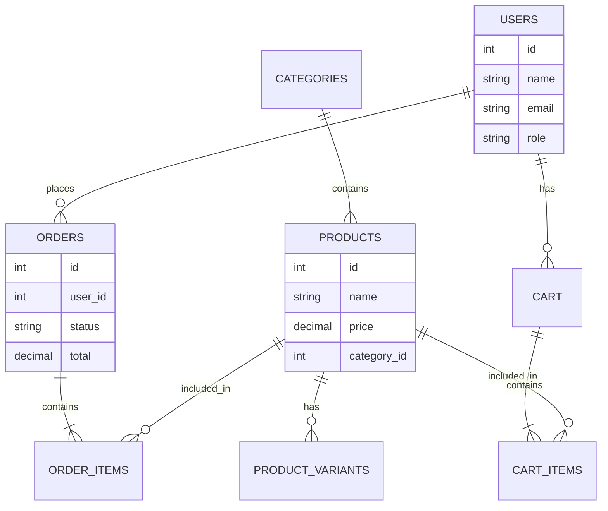

# Database Schema Design for "Isan Sausage & Dried Pork (Wholesale)"

This schema is designed to support a wholesale e-commerce platform.

## Tables

### 1. `users`
Stores customer and admin information.
- `id` (PK, INT, Auto Increment)
- `role` (ENUM: 'customer', 'admin')
- `name` (VARCHAR)
- `email` (VARCHAR, Unique)
- `phone` (VARCHAR)
- `password_hash` (VARCHAR)
- `address` (TEXT)
- `created_at` (DATETIME)

### 2. `categories`
Product categories (e.g., Isan Sausage, Dried Pork, Chili Paste).
- `id` (PK, INT, Auto Increment)
- `name` (VARCHAR)
- `slug` (VARCHAR)
- `image_url` (VARCHAR)

### 3. `products`
Main product table.
- `id` (PK, INT, Auto Increment)
- `category_id` (FK -> categories.id)
- `name` (VARCHAR)
- `description` (TEXT)
- `price_retail` (DECIMAL) - Retail price per unit
- `min_wholesale_qty` (INT) - Minimum qty for wholesale price
- `is_active` (BOOLEAN)
- `image_url` (VARCHAR)
- `created_at` (DATETIME)

### 4. `product_variants` (Optional)
If products have different sizes (e.g., 500g, 1kg).
- `id` (PK, INT, Auto Increment)
- `product_id` (FK -> products.id)
- `name` (VARCHAR) - e.g., "Pack 500g"
- `price` (DECIMAL)
- `sku` (VARCHAR)

### 5. `inventory`
Stock management.
- `id` (PK, INT, Auto Increment)
- `product_id` (FK -> products.id)
- `quantity` (INT)
- `last_updated` (DATETIME)

### 6. `orders`
Order headers.
- `id` (PK, INT, Auto Increment)
- `user_id` (FK -> users.id)
- `total_amount` (DECIMAL)
- `status` (ENUM: 'pending', 'paid', 'shipped', 'completed', 'cancelled')
- `shipping_address` (TEXT)
- `payment_method` (VARCHAR)
- `tracking_number` (VARCHAR)
- `created_at` (DATETIME)

### 7. `order_items`
Items within an order.
- `id` (PK, INT, Auto Increment)
- `order_id` (FK -> orders.id)
- `product_id` (FK -> products.id)
- `quantity` (INT)
- `price_at_time` (DECIMAL)

### 8. `cart`
Shopping cart for users.
- `id` (PK, INT, Auto Increment)
- `user_id` (FK -> users.id)
- `created_at` (DATETIME)

### 9. `cart_items`
- `id` (PK, INT, Auto Increment)
- `cart_id` (FK -> cart.id)
- `product_id` (FK -> products.id)
- `quantity` (INT)

### 10. `shipping_methods`
- `id` (PK, INT, Auto Increment)
- `name` (VARCHAR)
- `cost` (DECIMAL)
- `estimated_days` (VARCHAR)

## Relationships ER Diagram (Mermaid)

